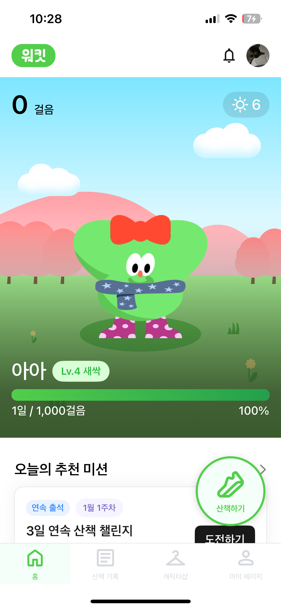
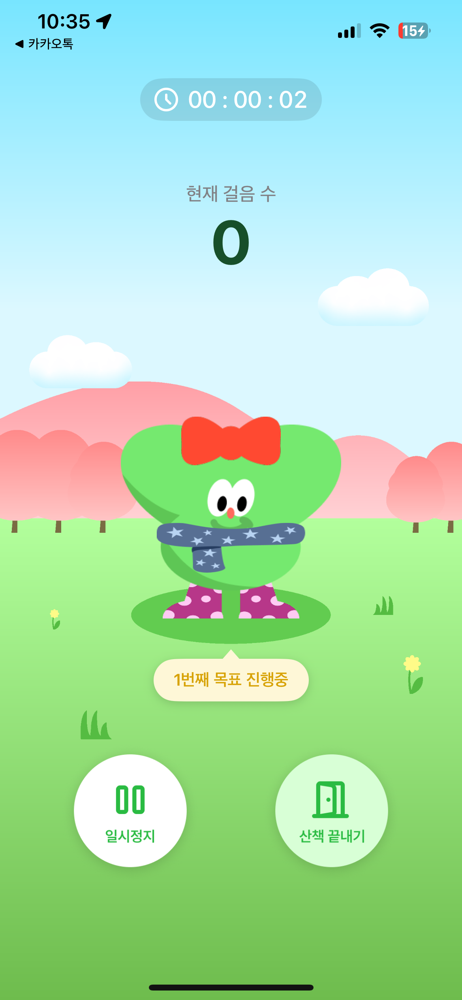
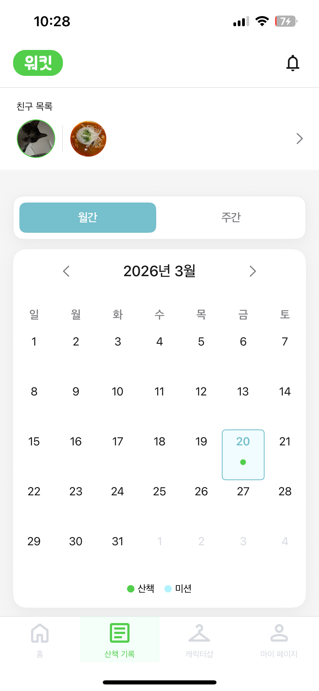

# WalkIt

산책 기록, 감정 트래킹, 캐릭터 성장 요소를 결합한 SwiftUI 기반 iOS 앱입니다.

## 1. 앱 한 줄 소개

WalkIt은 사용자의 산책 경로, 감정 변화, 캐릭터 성장 경험을 하나의 흐름으로 연결한 iOS 산책 동반 앱입니다.

## 2. 주요 기능

- 산책 경로 기록 및 이동 기록 조회
- 산책 전후 감정 선택 및 감정 기록 관리
- 캐릭터 성장 및 커스터마이징
- 목표, 미션, 알림, 마이페이지 관리
- 카카오 및 네이버 로그인 지원
- 푸시 알림 수신 및 처리

## 3. 기술 스택

- Swift
- SwiftUI
- MVVM
- CocoaPods
- Swift Package Manager
- Kakao Maps SDK
- Kakao Login SDK
- Naver Login SDK
- Firebase Messaging
- Realm
- Lottie
- Kingfisher
- Alamofire
- CoreLocation
- CMPedometer

## 4. 실행 방법

### 개발 환경

- Xcode 16 이상 권장
- iOS 16.0 이상 권장
- CocoaPods 설치 필요

### 실행 준비

```bash
git clone <your-repo-url>
cd WalkIt
pod install
cp Config/Secrets.example.xcconfig Config/Secrets.xcconfig
open WalkIt.xcworkspace
```

### 로컬 설정

아래 파일은 로컬에서 직접 추가해야 하며 Git에는 포함되지 않습니다.

- `Config/Secrets.xcconfig`
- `WalkIt/GoogleService-Info.plist`

`Config/Secrets.xcconfig`에는 예를 들어 아래 값이 필요합니다.

```xcconfig
KAKAO_APP_KEY = your_kakao_native_app_key
BASE_URL = https://your-api-server.example.com
```

## 5. 화면 미리보기

아래 경로에 스크린샷을 추가하면 README에서 바로 표시할 수 있습니다.

- `docs/screenshots/login.png`
- `docs/screenshots/home.png`
- `docs/screenshots/walking.png`
- `docs/screenshots/record.png`
- `docs/screenshots/character.png`
- `docs/screenshots/mypage.png`

| Login | Home | Walking |
|---|---|---|
|  |  |  |

| Record | Character | My Page |
|---|---|---|
|  |  |  |

## 6. 트러블슈팅 / 구현 포인트

- `Info.plist`에 직접 넣던 SDK 키를 `xcconfig`로 분리해 민감 정보가 Git에 포함되지 않도록 구성했습니다.
- `Kakao Maps SDK`를 사용해 산책 경로를 지도 위에 시각화했습니다.
- `CoreLocation`과 걸음 수 데이터를 활용해 산책 기록 흐름을 구성했습니다.
- `Firebase Messaging`을 이용해 푸시 알림 수신과 포그라운드 알림 처리를 구현했습니다.
- `Realm`을 사용해 산책 기록, 미션 상태 등 로컬 데이터를 관리했습니다.
- `Lottie`를 사용해 캐릭터 성장 및 커스터마이징 화면의 애니메이션 표현을 구현했습니다.

## 7. 아키텍처

이 프로젝트는 MVVM 스타일 구조를 기반으로 구성했습니다.

- `View`: SwiftUI 화면 및 UI 구성
- `ViewModel`: 화면 상태 관리와 프레젠테이션 로직 담당
- `Model`: 도메인 모델, 응답 모델, 라우팅 정의
- `Servicee`: 인증, 네트워크, 위치, 알림, 로컬 저장소 처리
- `Component`: 공통 UI 컴포넌트 및 재사용 뷰

## 8. 프로젝트 구조

```text
WalkIt/
├── Config/
├── WalkIt/
│   ├── Model/
│   ├── Protocol/
│   ├── Servicee/
│   ├── View/
│   ├── ViewModel/
│   ├── Assets.xcassets/
│   └── LottieJson/
├── WalkItTests/
├── WalkItUITests/
├── Podfile
└── WalkIt.xcworkspace
```

## 9. 참고 사항

저장소에는 아래 항목이 포함되지 않습니다.

- `Pods/`
- `xcuserdata/`
- `*.xcuserstate`
- `Config/Secrets.xcconfig`
- `WalkIt/GoogleService-Info.plist`
- 빌드 산출물
